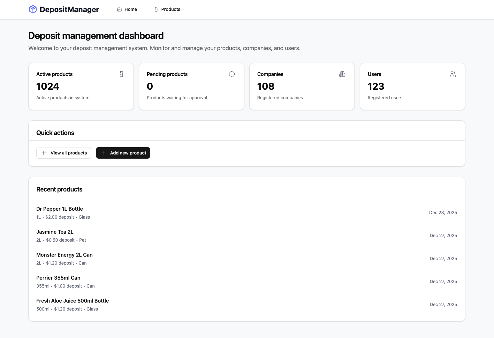

# Sensoneo React Senior Developer Interview Task

Welcome to the Sensoneo React Senior Developer interview task! This project is designed to assess your React, TypeScript, and frontend development skills.

## Project Overview

This is a **Deposit Management System** built with React and TypeScript. The application helps manage products, companies, and users in a deposit return system context.

## Project Structure

### 🖥️ **Server** (`/server` folder)

- **Express.js API server** with mock data
- Provides REST endpoints for products, companies, and users
- Includes comprehensive API documentation (Swagger)
- **⚠️ IMPORTANT: You cannot modify anything in the `/server` folder**
- Start the server with: `cd server && npm install && npm run dev`
- Server runs on `http://localhost:3001`
- Swagger API docs are available on `http://localhost:3001/api-docs`

### 💻 **Client** (`/src` folder)

- **React 19 + TypeScript** frontend application
- Your main working area - modify anything you need here
- Client runs on `http://localhost:5173`

## What's Already Set Up For You

We've prepared a solid foundation to help you focus on the core tasks:

### 🏗️ **Architecture & Routing**

- **React Router v7** with layout structure
- **TanStack Query** for API state management (configured with sensible defaults)
- Clean modular project structure with separate folders for components and features

### 🎨 **UI & Styling**

- **Tailwind CSS** for styling
- **shadcn/ui** component library with pre-built components:
  - `Table`, `Card`, `Button`, `Input`, `Select`, `Checkbox`
  - `Badge`, `Skeleton`, `Pagination`, and more
- **Lucide React** icons

### 🔧 **Development Tools**

- **Vite** for fast development and building
- **ESLint** and **Prettier** for code quality
- **TypeScript** configuration ready to use

## Your Freedom

While we've provided a solid foundation, **you're free to:**

- Install and use any additional libraries you prefer
- Modify the existing code structure if needed
- Add your own components, utilities, or helpers
- Choose your preferred patterns and approaches

## 🎯 **Your Tasks**

### Task 1: Create a Dashboard (Homepage)

**Objective**: Implement a dashboard based on the provided design mockup (`docs/dashboard.png`).



**Requirements**:

- Display key metrics (active products, pending products, companies, users)
- Show a "Recent products" section with 5 latest registered **active** products
- Include quick action buttons
- Match the design and layout shown in the mockup
- Fetch real data from the API endpoints (real data might differ from values in design mockup)

### Task 2: Create a Form for New Product (Homepage)

**Objective**: Implement a form that creates a new product. Design is up to you.

**Requirements**:

- Display form in a modal window on click "Add new product"
- Include all fields according to API docs for creating a new product
- Don't forget validation on fields and error handling
- Refresh all related data after successfully creating a product

### Task 3: Products Table with Filtering

**Objective**: Create a products page with a table that allows filtering by active state. Design is up to you.

**Requirements**:

- Display all products in a table format
- Include relevant product information (name, packaging, deposit, volume, etc.)
- Implement filtering by product active/inactive status
- Make sure the table can handle large data sets

## 🚀 **Getting Started**

### **Step 1: Clone the repository and push into the new one without modification**

⚠️ **Important**: Do NOT push your changes to our original repository. You must create your own repository for your solution.

- Create a **public repository** on either:
   - **GitHub** (github.com)
   - **Microsoft Azure DevOps** (dev.azure.com)

```bash
git clone https://sensoneo@dev.azure.com/sensoneo/react-interview-tasks/_git/senior-react-interview-task
cd senior-react-interview-task
git remote remove origin
# (or your Azure DevOps URL)
git remote add origin https://github.com/your-username/your-repo-name.git
git push --set-upstream origin 
```

### **Step 2: Start the API Server**

```bash
# In the root directory
cd server
npm install
npm run dev
```

### **Step 4: Start the Client Application**

```bash
# In the root directory (not in server folder)
npm install
npm run dev
```

### **Step 5: Open Your Browser**

- Client: `http://localhost:5173`
- API Documentation: `http://localhost:3001/api-docs`

## 📝 **Notes**

- **TypeScript**: You'll need to create your own type definitions by examining the API responses
- **API Structure**: All API responses follow a consistent format with `success`, `data`, and `total` fields
- **Data**: The server contains realistic mock data with both active and inactive products
- **Time**: Focus on code quality, proper TypeScript usage, and clean component architecture
- **Questions**: Feel free to ask questions about requirements or clarifications

## 🔍 **What We're Looking For**

- Correctness of your solution
- Performance
- Clean, readable, and maintainable code
- Proper TypeScript usage
- Effective use of React patterns
- Good component structure and separation of concerns
- Error handling and loading states
- Attention to detail in matching the design

You're not expected to finish everything, but it's better to do less and properly than to do more and poorly.
Feel free to include some **short** notes about your solution if its not obvious from the code (why your feature is done a certain way, what you would improve if you had more time, any known limitations...)
The task will be reviewed by your future colleagues, we are interested in how you think about the solution.

## 📤 **How to Submit Your Solution**


   ### Squash all your work into a single commit
   ```bash
   git add .
   git commit -m "Complete interview tasks: Dashboard and Products table with filtering"
   git push -u origin main
   ```

   Please **squash all your commits** into a single commit before submission. This makes the code review process cleaner and more focused.

3. **Submit the link**:
   - Send us the public repository URL
   - Make sure the repository is accessible without authentication

**Example submissions**:

```
GitHub: https://github.com/your-username/sensoneo-interview-task
Azure: https://dev.azure.com/your-org/your-project/_git/repo-name
```

Good luck! 🚀
